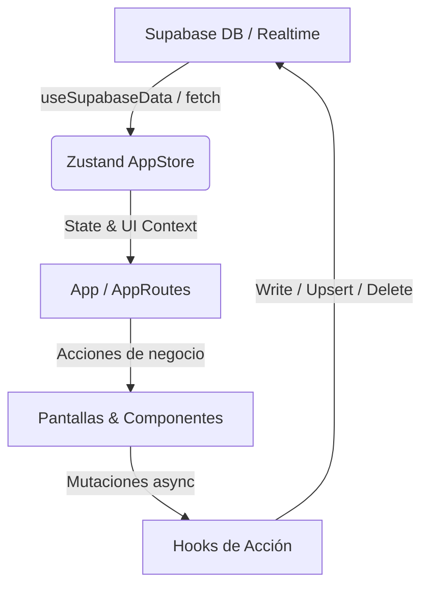

# Manual Técnico de Desarrollo y Mantenimiento — CIELO

**Nombre del Sistema:** CIELO  
**Tipo:** Plataforma SaaS Educativa (Sistema de Evaluación por Competencias)  
**Autora:** Mary Esther Martínez Escoboza  
**Destino:** Registro de Soporte Material ante la Oficina Nacional de Derecho de Autor (ONDA)  

## 1. Objetivo
Este documento describe la arquitectura técnica del sistema, su flujo de datos, contratos entre módulos y criterios de mantenimiento.
Esta versión está orientada a:
- Desarrolladores que implementan nuevas funciones.
- Equipo de soporte técnico.
- Mantenimiento correctivo/evolutivo.

## 2. Stack y Entorno

### 2.1 Frontend
- **React 19 + TypeScript**
- **Vite** (Empaquetador y servidor de desarrollo)
- **Tailwind CSS** (Estilos y variables de diseño)
- **Zustand** (Gestión de estado global y persistencia local)
- **Lucide React** (Set de iconos del sistema)

### 2.2 Desktop
- **Electron 32**
- Entrada Electron: `electron/main.ts`
- Preload: `electron/preload.js` (generado a partir de preload.mjs)

### 2.3 Backend
- **Supabase** (Autenticación, Base de datos relacional PostgreSQL, Storage para archivos/avatars y Realtime para actualizaciones en tiempo real)
- Cliente Supabase: `src/lib/supabase.ts`

### 2.4 Scripts Relevantes
- `npm run dev`: Inicia el entorno concurrente de desarrollo (frontend Vite + backend servidor local si aplica).
- `npm run build`: Compila TypeScript y empaqueta el frontend con Vite.
- `npm run lint`: Ejecuta las reglas de validación de código con ESLint.

---

## 3. Estructura de Carpetas

- `src/App.tsx`: Punto de entrada del árbol de componentes, inicializa el almacén y envuelve las rutas con el Layout.
- `src/AppRoutes.tsx`: Configuración de enrutamiento del sistema a través de `react-router-dom`.
- `src/screens/*`: Módulos de interfaz de usuario de las vistas/pantallas principales.
- `src/components/*`: Componentes UI compartidos y widgets del panel (gráficos, modales, etc.).
- `src/store/appStore.ts`: Almacén Zustand centralizado para el estado global de datos y de UI.
- `src/hooks/*`: Hooks de acción delegada por dominio (`useCourseActions.ts`, `useStudentActions.ts`, etc.) e integración con Supabase (`useSupabaseData.ts`).
- `src/types/index.ts`: Contratos de tipos de datos de dominio y de la aplicación.
- `src/data/mockData.ts`: Estado semilla y valores de respaldo por defecto.
- `electron/*`: Lógica de arranque y configuración de la aplicación de escritorio.

---

## 4. Arquitectura de Runtime y Estado (Zustand)

El sistema utiliza una arquitectura reactiva y centralizada para simplificar el flujo de datos:

1. **useAppStore (`src/store/appStore.ts`)**:
   - Centraliza el `AppState` (cursos, estudiantes, actividades, calificaciones, incidencias, publicaciones, notificaciones, etc.).
   - Controla el estado de sesión de Supabase Auth, indicadores de carga (`loading`), tema oscuro (`darkMode`) e interacciones globales como notificaciones breves (`genericToast`) y ventanas emergentes flotantes para rúbricas (`floatingRubrics`).
   - Usa persistencia de Zustand para persistir ciertas preferencias (como el modo oscuro).
2. **Ciclo de Carga**:
   - `useAppInitialization` detecta el estado de la sesión de Supabase.
   - Si existe una sesión activa, se ejecuta `useSupabaseData().fetchData(isSilent)` para alimentar el almacén Zustand con los datos actualizados desde la base de datos PostgreSQL.
3. **Manejo de Acciones**:
   - Los handlers de negocio ya no están acoplados a una única jerarquía en `App.tsx`. Se estructuran en hooks específicos por dominio (ej. `useCourseActions`, `useStudentActions`, `useEvaluationActions`) que mutan el estado local de Zustand de forma optimista y actualizan asíncronamente Supabase.
4. **Suscripción Realtime**:
   - Supabase Realtime detecta cambios concurrentes en tablas críticas (`posts`, `notificaciones`, `curso_detalle`) y actualiza instantáneamente el almacén Zustand sin requerir recargas manuales.

---

## 5. Modelo de Tipos (Dominio)

Definiciones principales localizadas en [types/index.ts](file:///c:/Users/user/OneDrive/Escritorio/Evaluaci%C3%B3n%20por%20competencias/src/types/index.ts):
- `AppState`: Representación en memoria de la base de datos local y configuración de la escuela (instituto, cursos, estudiantes, etc.).
- `Curso`, `Estudiante`, `Actividad`, `CalificacionActividad`: Entidades del núcleo educativo.
- `RecuperacionBC`: Modelo para gestionar las recuperaciones por competencias (BC1 a BC4).
- `Secuencia`: Datos de planificación pedagógica y secuencias didácticas.
- `Incidencia`: Reportes disciplinarios y académicos.
- `Post` y `PostLike`: Entidades de la red social de la comunidad educativa.
- `Plantilla`, `DescriptorRubrica`, `CriterioCotejo`: Contratos para la evaluación formativa avanzada.
- `EvaluacionRubrica`, `EvaluacionCotejo`: Evaluaciones aplicadas asociadas a estudiantes y actividades.
- `CursoDetalleEvaluacion` / `CursoDetalle`: Registro consolidado de desempeño evaluativo por actividad/estudiante.

> [!NOTE]
> La aplicación realiza un mapeo automático entre la notación `camelCase` del frontend de React y el formato `snake_case` requerido por la base de datos Supabase al leer y guardar datos.

---

## 6. Tablas Supabase Utilizadas

### Tablas de Lectura / Escritura
- `perfiles`: Detalles personales del docente y rol asignado.
- `instituciones`: Escuelas o centros educativos asociados a los docentes.
- `cursos`: Cursos creados por los tutores.
- `curso_docentes`: Relaciones y permisos de co-docencia asignados para impartir áreas específicas en cursos ajenos.
- `estudiantes`: Estudiantes pertenecientes a cada curso.
- `actividades`: Actividades o tareas planificadas.
- `calificaciones`: Notas/calificaciones numéricas tradicionales asociadas a actividades.
- `recuperaciones`: Evaluaciones extraordinarias para recuperar notas bajas por competencia.
- `secuencias`: Planificaciones didácticas detalladas de los docentes.
- `incidencias`: Faltas disciplinarias o incidencias de los alumnos.
- `eventos`: Eventos del calendario escolar.
- `posts` / `post_likes`: Feed de comunicación y red social interna.
- `notificaciones`: Mensajería del sistema para alertas de co-docencia y avisos.
- `docentes`: Entidad histórica de profesores.
- `plantillas`: Plantillas guardadas de Rúbricas o Listas de Cotejo.
- `descriptores_rubrica` / `niveles_puntaje`: Estructuras de configuración para rúbricas analíticas.
- `evaluaciones_rubrica` / `criterios_cotejo` / `evaluaciones_cotejo`: Evaluaciones formativas específicas aplicadas.
- `curso_detalle`: Tabla unificada que consolida las calificaciones finales, indicadores alcanzados y comentarios de evaluación de cada actividad por estudiante.

### Storage buckets
- `avatars`: Contenedor para almacenar las fotos de perfil de los docentes y usuarios del sistema.

---

## 7. Capa de Datos e Integración: `useSupabaseData`

La sincronización de datos con el backend se realiza mediante el hook unificado `useSupabaseData.ts`:

1. `fetchData(isSilent)`:
   - Recupera la información de todas las tablas de forma paralela usando promesas.
   - Aplica el formateador de tipos para transformar las llaves de base de datos (`snake_case`) a llaves del dominio de frontend (`camelCase`).
   - Envía el resultado agregando toda la información a Zustand a través de `setAppState`.
2. `syncUpsert(table, data)`:
   - Convierte los campos a formato `snake_case`.
   - Asocia el `user_id` de la sesión actual al registro.
   - Realiza la operación de guardado/actualización (`upsert`) genérica en Supabase.
3. `syncDelete(table, idOrFilter)`:
   - Ejecuta peticiones de eliminación apuntando por ID único o mediante un objeto de filtrado dinámico.
4. **Actualización optimista**:
   - Para mejorar la velocidad percibida, muchas mutaciones actualizan primero Zustand para refrescar la UI inmediatamente, ejecutando la persistencia física en Supabase en segundo plano.

---

## 8. Contratos por Pantalla y Rutas

El sistema emplea `react-router-dom` para estructurar la navegación mediante las siguientes rutas y componentes en `AppRoutes.tsx`:

### 8.1 Autenticación (Auth)
- **Ruta**: `/` (si no hay sesión)
- **Archivo**: `src/screens/Auth.tsx`
- **Función**: Maneja el registro de nuevos usuarios, creación de perfiles y la autenticación. Al registrarse, asocia al usuario a un centro educativo (`instituciones`).

### 8.2 Inicio (Home)
- **Ruta**: `/`
- **Archivo**: `src/screens/Inicio.tsx`
- **Función**: Dashboard inicial con widgets informativos (calendario escolar, actividades próximas, conteo rápido de KPIs, etc.). Permite la edición rápida del nombre del instituto/colegio del docente.

### 8.3 Dashboard Analítico
- **Ruta**: `/dashboard`
- **Archivo**: `src/screens/Dashboard.tsx` y `src/screens/DashboardCharts.tsx`
- **Función**: Muestra visualizaciones y análisis estadísticos avanzados del rendimiento escolar (gráficos de promedios, distribución de estudiantes según su nivel de rendimiento, estudiantes en riesgo, distribución de población estudiantil). Permite crear registros rápidos de observación docente adjuntando imágenes.

### 8.4 Cursos
- **Ruta**: `/cursos`
- **Archivo**: `src/screens/Cursos.tsx`
- **Función**: Lista y CRUD de asignaturas/cursos. Incluye la asignación de días y horas de clase a la semana y la invitación a co-docentes para compartir asignaturas.

### 8.5 Detalle del Curso (CursoDetalle)
- **Ruta**: `/curso-detalle` / `/curso-detalle/:id`
- **Archivo**: `src/screens/CursoDetalle.tsx`
- **Función**: Vista matricial de control escolar. Permite calificar directamente a los estudiantes en cada actividad del curso, asignar co-docentes por área y gestionar recuperaciones por competencia (BC).

### 8.6 Incidencias disciplinarias
- **Ruta**: `/incidencias`
- **Archivo**: `src/screens/Incidencias.tsx`
- **Función**: Bitácora de incidencias disciplinarias y académicas de los estudiantes del docente. Permite filtrar registros y realizar altas/bajas de incidencias de manera fluida.

### 8.7 Planificación (Secuencias didácticas)
- **Ruta**: `/planificacion`
- **Archivo**: `src/screens/Planificacion.tsx`
- **Función**: Herramienta de planificación para crear secuencias didácticas semanales o trimestrales con visualizador de modo presentación (pantalla completa sin distracciones).

### 8.8 Comunidad Pedagógica
- **Ruta**: `/comunidad`
- **Archivo**: `src/screens/Comunidad.tsx`
- **Función**: Red social integrada donde los profesores comparten recursos educativos, interactúan con posts de otros usuarios (likes) e importan secuencias didácticas o plantillas directamente a sus asignaturas.

### 8.9 Evaluación por Rúbrica Analítica
- **Ruta**: `/rubrica`
- **Archivo**: `src/screens/Rubrica.tsx`
- **Función**: Evaluación cualitativa mediante descriptores de niveles de desempeño (1 al 4). Soporta copiado y pegado masivo desde planillas de cálculo (TSV) y guardado individual o colectivo.

### 8.10 Lista de Cotejo
- **Ruta**: `/cotejo`
- **Archivo**: `src/screens/Cotejo.tsx`
- **Función**: Evaluación ágil mediante cumplimiento de criterios de cotejo de "Logrado / No Logrado".

### 8.11 Ficha del Estudiante
- **Ruta**: `/estudiante`
- **Archivo**: `src/screens/Estudiante.tsx`
- **Función**: Perfil analítico individual de cada estudiante, mostrando sus fortalezas, gráfico de progresión académica y listado oficial de notas si el docente es su tutor oficial.

### 8.12 Reporte Anual (Calificaciones Anuales)
- **Ruta**: `/calificaciones-anuales/:id`
- **Archivo**: `src/screens/CalificacionesAnuales.tsx`
- **Función**: Sabana completa consolidada anual por períodos evaluativos. Contempla notas regulares, recuperaciones extraordinarias e impresión directa de boletines oficiales.

### 8.13 Ajustes de Perfil (ProfileSettings)
- **Ruta**: `/ajustes`
- **Archivo**: `src/screens/ProfileSettings.tsx`
- **Función**: Edición de la información profesional del docente, cambio de color de avatar y avatar de perfil, y personalización estética de su interfaz.

### 8.14 Recuperación de Contraseña
- **Ruta**: `/reset-password`
- **Archivo**: `src/screens/ResetPassword.tsx`
- **Función**: Pantalla de restablecimiento seguro de credenciales para usuarios que inician flujo de recuperación.

### 8.15 Impresión de Boletines
- **Ruta**: `/print-boletines/:cursoId`
- **Archivo**: `src/screens/PrintBoletines.tsx`
- **Función**: Vista optimizada para la impresión y exportación de reportes académicos, alineada a formatos de impresión A4 para boletines escolares.

---

## 9. Flujo de Evaluación Unificada (`curso_detalle`)

Las calificaciones numéricas tradicionales, las valoraciones cualitativas de Rúbricas y los criterios de Cotejo convergen en la tabla unificada `curso_detalle`.

- **Consistencia**: Esta tabla funciona como la única fuente de verdad (Single Source of Truth) para calcular las estadísticas académicas de los estudiantes y el estado de riesgo escolar visible en el dashboard.
- **Sincronización**: Al guardar una evaluación cualitativa en Rúbrica o Cotejo, el sistema computa el puntaje correspondiente (según la escala de niveles 1-4) y lo vuelca automáticamente en `curso_detalle` junto con las observaciones y calificaciones de la actividad.

---

## 10. Seguridad y Mitigación de Deuda Técnica

1. **Variables de Entorno**:
   - Las credenciales de Supabase se cargan mediante variables de entorno seguras en el archivo `.env` (`VITE_SUPABASE_URL` y `VITE_SUPABASE_ANON_KEY`), evitando código expuesto en los archivos de distribución.
2. **Endurecimiento de Electron**:
   - *Riesgo*: Uso previo de `nodeIntegration: true` y `contextIsolation: false` en configuraciones heredadas.
   - *Acción Recomendada*: Migrar progresivamente a `contextIsolation: true` haciendo puente de funciones del sistema de archivos o configuración a través de un archivo `preload.js` seguro utilizando `contextBridge`.
3. **Manejo de Caché de GPU en Windows**:
   - Se añadió `app.disableHardwareAcceleration()` en el inicio de Electron (`electron/main.ts`) para prevenir errores de bloqueo de archivos y denegación de accesos en entornos virtuales o Windows corporativos.

---

## 11. Troubleshooting y Resolución de Problemas

### 11.1 La aplicación no carga información
- Comprobar que el archivo `.env` en la raíz contiene las credenciales válidas de Supabase.
- Verificar en las herramientas de desarrollo del navegador o Electron si existen bloqueos de CORS o credenciales incorrectas en la llamada a `createClient`.
- Confirmar que hay conexión de red estable y el backend de Supabase no se encuentra en pausa por inactividad.

### 11.2 Falta de sincronización en tiempo real
- Verificar que el WebSocket de Supabase Realtime no esté bloqueado por firewalls locales o proxy de red.
- Validar las políticas de seguridad a nivel de fila (RLS) en Supabase para asegurar que el docente tiene permiso para recibir notificaciones de ese curso específico.

### 11.3 Problemas al subir imágenes o avatars
- Comprobar que el bucket `avatars` existe en el panel de Supabase y tiene habilitados los permisos públicos de lectura y escritura para usuarios autenticados.

---

## 12. Checklist de Mantenimiento Antes de un Release

1. **Pruebas Estáticas**:
   - Correr `npm run lint` y solucionar advertencias o errores reportados.
   - Ejecutar `npm run build` para asegurar la compilación del tipado de TypeScript.
2. **Validación del Flujo Principal**:
   - Verificar inicio de sesión y persistencia de cookies.
   - Probar la creación de un nuevo curso y la edición del boletín de calificaciones del estudiante.
   - Validar que al evaluar una actividad por Rúbrica se calcule y actualice el promedio en la ficha individual del Estudiante y en el Dashboard Analítico.
3. **Generación de Documentación**:
   - Actualizar el manual técnico si hay modificaciones en el esquema de tablas o en la estructura de ruteo.
   - Ejecutar `node tools/md_to_print_html.js MANUAL_TECNICO_DESARROLLO.md MANUAL_TECNICO_DESARROLLO.html` para compilar los cambios al manual impreso en formato HTML.

---

## 13. Archivos Clave de Referencia

*   [App.tsx](file:///c:/Users/user/OneDrive/Escritorio/Evaluaci%C3%B3n%20por%20competencias/src/App.tsx) - Inicializador raíz de la aplicación React.
*   [AppRoutes.tsx](file:///c:/Users/user/OneDrive/Escritorio/Evaluaci%C3%B3n%20por%20competencias/src/AppRoutes.tsx) - Enrutador general del sistema.
*   [appStore.ts](file:///c:/Users/user/OneDrive/Escritorio/Evaluaci%C3%B3n%20por%20competencias/src/store/appStore.ts) - Definición del almacén Zustand.
*   [useSupabaseData.ts](file:///c:/Users/user/OneDrive/Escritorio/Evaluaci%C3%B3n%20por%20competencias/src/hooks/useSupabaseData.ts) - Integración y consultas SQL a Supabase.
*   [main.ts](file:///c:/Users/user/OneDrive/Escritorio/Evaluaci%C3%B3n%20por%20competencias/electron/main.ts) - Lanzador de la ventana nativa de Electron.
